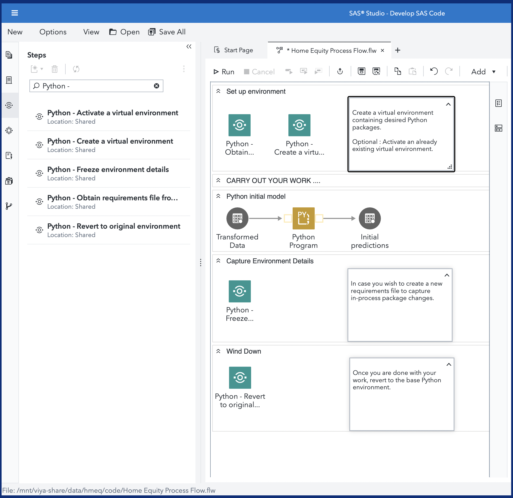
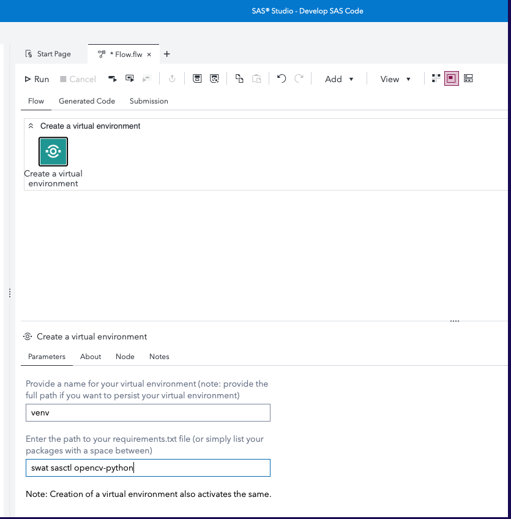
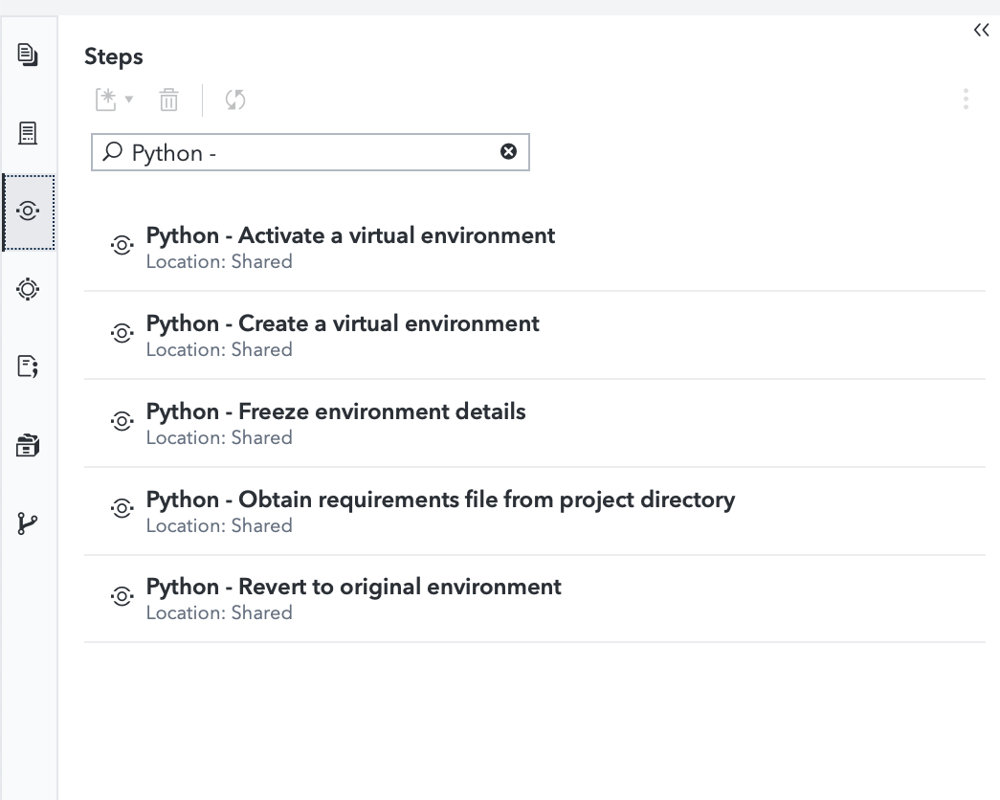

# Python - Create a Virtual Environment

## Description
Package your Python-based analytics solutions in a portable, repeatable, and reusable manner.  This SAS Studio custom step helps you create a virtual Python environments for use within SAS Viya. This enables ephemeral and isolated sessions.  

A general idea of how to use steps related to virtual environments:

A quick video:[Video](./img/Create%20a%20Virtual%20Environment.mp4)

## User Interface

Refer the "About" tab on each of the individual steps for more details on what they are used for.

### Parameters
This step helps you create a virtual environment. Input arguments required :
1. A location for your virtual environment to reside (which can optionally be expressed as a full path to a persistent location on the filesystem, for future retrieval)
2. Additional packages you would like installed inside this virtual environment. As instructions note, you can provide a space-delimited string, or a path to a requirements.txt file.

## Requirements

1. A SAS Viya 4 environment (last update on a monthly release 2025.07) with SAS Studio Flows
2. Python configured with the above environment (preferably using the [SAS Configurator for Open Source](https://go.documentation.sas.com/doc/en/itopscdc/v_016/itopswn/p19hj5ipftk86un1axa51rzr5mxv.htm))

## Installation & Usage

Refer to the [steps](../README.md#getting-started---making-a-custom-step-from-this-repository-available-in-sas-studio) listed in the main README.md

When successfully uploaded, the following structure will be present in the Shared Section of your SAS Studio application - Custom Steps tab.

## The WHY :  Background information

Refer this [blog](https://blogs.sas.com/content/subconsciousmusings/2022/05/16/python-a-la-carte) for background.  The ability to create and use virtual Python environments for use within SAS Viya helps data scientists create portable solutions,  maintain solution integrity, and exploit the integration between SAS and Python to the fullest extent.

Watch this example! 

[SAS & Open Source (Python) Integration : Better Together](https://www.youtube.com/watch?v=YVaX-A-ZsQ0&list=PLpe69msCs2C8IcarG0aEs_iKy4gyRSFPN&index=3)

[Creating virtual Python environments within SAS Studio.](https://youtu.be/UIYZf2bKcWw)

This repository contains 5 custom steps which are offered as examples of how you could create, activate, switch between, and package virtual Python environments from within SAS Viya applications and tools, such as SAS Studio.  It makes use of [Custom Steps](https://go.documentation.sas.com/doc/en/webeditorcdc/v_006/webeditorug/n0b7ljqhka8lh5n12judc27x5gph.htm), a component within SAS Studio which help users package repeatable steps in an user-friendly manner.

## Change Log

* Version 2.1.0 (01SEP2025)
  - Converted ORIGINAL_PYPATH to global macro variable to avoid breaking downstream steps
* Version 2.0.0 (26AUG2025)
  - **Refactored code to leverage venv (*Goodbye, virtualenv!*)**
  - Separate folder in repository
  - Additional parameters
  - Accepts folder selector as input
  - Handles errors in requirements and folder input
  
* Version 1.1 (12JUL2022)
  - Added new Custom Step - "Python - Obtain requirements from project directory"
  
* Version 1.0 (20MAY2022)
  - Renamed to "Python - " as per Wilbram's advice; shuffled order of About tab on "Freeze"

